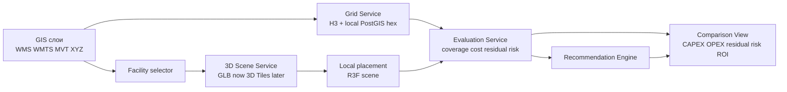
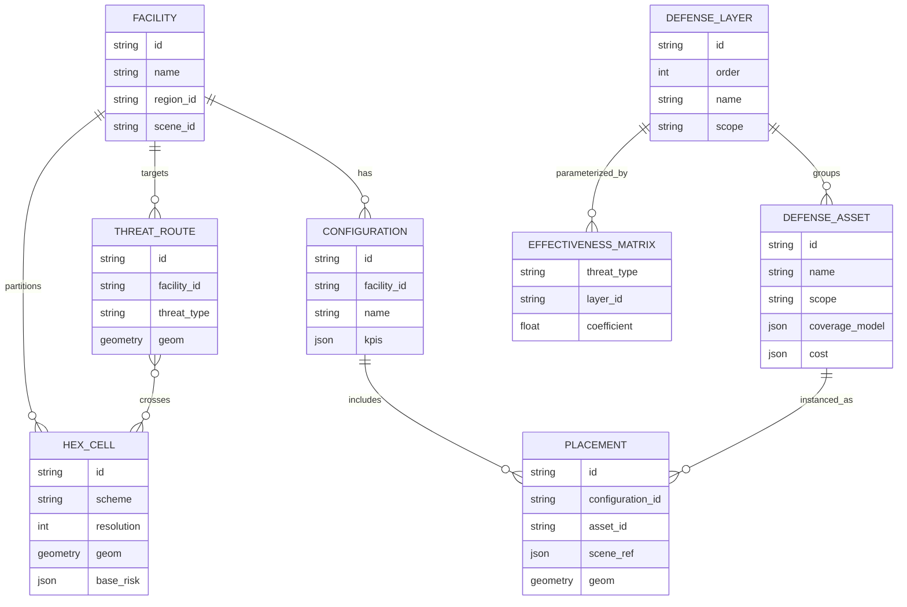

# Defense Configuration Studio

## Executive summary

Текущий прототип уже показывает правильную «витрину» продукта: на опубликованной странице есть сценарии, панель защитных элементов, переключение между 3D-картой и гексокартой, панель свойств, KPI-блок и действие запуска симуляции. В репозитории прототип уже вынесен в отдельный route `/src/app/prototype` и отдельный модуль компонентов, а стек проекта уже включает Next.js, React, React Three Fiber, Three.js, Ant Design, Recharts и Zustand. Это хорошая база для демо. Но по коду видно, что пока это скорее визуальная сцена, чем полноценный конфигуратор: типизировано только пять видов защитных объектов, `scenarioPresets` пусты, а в топбаре в коде виден только `baseline`. Иными словами, UI уже обещает «систему», а внутренняя модель пока ещё не дотягивает до уровня real decision-support tool. citeturn1view0turn1view1turn1view2turn1view4turn4view0turn4view3

С учётом уточнённого требования — **Excel больше не должен быть основным источником**, а **8 из 9 эшелонов живут на территории вплоть до регионального масштаба** — оптимальная форма продукта меняется. Главным экраном должен стать не 3D-вид предприятия, а **GIS-first конфигуратор**, где пользователь видит регион, зоны покрытия, маршруты угроз, facility-узлы и набор конфигураций защиты. 3D должно остаться как **drill-down в конкретный объект/площадку**, особенно для локальных и физически-наглядных мер — а это как раз те типы ассетов, которые уже присутствуют в прототипе: операторная/подстанция, защитные леса, ФБС, периметральный барьер, сеточная завеса. citeturn1view0turn1view2

Технологически это лучше всего решается гибридным стеком: **GIS-слой** на `react-map-gl` + `deck.gl` или на `OpenLayers`, **геопространственный backend** на `PostGIS + GeoServer + GeoWebCache`, **enterprise 3D drill-down** на уже существующем `@react-three/fiber`, а `CesiumJS` — как следующий шаг для полноценного регионального 3D-оперативного представления и потоковой работы с `3D Tiles`. Это решение хорошо ложится на официально поддерживаемые форматы: `GeoJSON` для транзакционных геообъектов, `WMS/WMTS/XYZ` для картографических слоёв, `MVT` для быстрых векторных тайлов и `3D Tiles` для крупных 3D-сцен и геопривязанных 3D-наборов. citeturn14search6turn14search16turn7search0turn8search16turn10search0turn5search2turn6search2turn6search3turn8search3turn13search0turn13search1turn9search0turn9search3turn9search9turn5search6turn6search1

Краткие рекомендации для презентации заказчику:

- **Позиционировать продукт как GIS-first конфигуратор эшелонированной защиты**, а не как «ещё одну 3D-карту». Главная ценность — быстро собрать, сравнить и обосновать конфигурации по стоимости, остаточному риску и покрытию слоёв.
- **Оставить текущую 3D-сцену как drill-down в площадку**, потому что уже имеющиеся 3D-ассеты естественно соответствуют локальным физическим мерам защиты, а не региональным эшелонам. citeturn1view0turn1view2
- **Убрать Excel из runtime**: Excel — только migration/import/export канал; source of truth — каталог, матрица эффективности, маршруты угроз и конфигурации в API и PostGIS.
- **Сделать киллер-фичей comparison + recommendation engine**: «какая конфигурация дешевле, что она даёт по риску, и какое следующее вложение даёт лучший эффект на рубль».
- **Ввести двухуровневую пространственную модель**: H3/региональные гексы для территориального уровня и локальную метрическую hex/grid-сетку в PostGIS для точного site-level расчёта.

## Текущее состояние и продуктовый разрыв

Если смотреть на live-прототип как на сценарий демонстрации, уже видны почти все важные визуальные элементы: сценарии «Без защиты / Базовая защита / Усиленный периметр / Каталог защиты», список защитных элементов, вид «3D-карта / Гексокарта», несколько точек обзора, карточка свойств и KPI-блок с защищёнными объектами, перекрытием периметра, отражёнными атаками, остаточным риском и CAPEX. Это хороший «каркас доверия»: заказчик уже видит, что команда умеет в интерактивную сцену, объекты, статусные панели и story-driven demo. citeturn1view0

Но по исходникам разрыв тоже хорошо виден. В `package.json` есть всё необходимое для дальнейшего развития в сторону аналитического продукта — `@react-three/fiber`, `@react-three/drei`, `three`, `antd`, `recharts`, `zustand`. Одновременно типизированная модель прототипа пока очень узкая: `ProtectiveObjectKind` содержит только пять локальных объектов, сценарии определены как `baseline | perimeter | assets | night`, а `scenarioPresets` пусты. В `Topbar` зашит `visibleScenarios: ["baseline"]`, а `StatusBar` оперирует главным образом `sensorCount`, `cameraCount`, `postCount`, `coverage`, `perimeter`. Это означает, что нынешняя версия хорошо решает задачу визуального storytelling, но ещё не решает задачу **конфигурационного расчёта**. citeturn1view1turn1view2turn1view3turn1view4

С практической точки зрения это и есть главный product gap. Заказчику нужен не просто интерфейс, где можно «поставить объект на карту», а инструмент, который отвечает на вопросы: **что поставить, на каком уровне, в какой зоне, сколько это стоит, какие эшелоны закрывает, какой риск остаётся, и какая альтернатива выгоднее**. В приложенных материалах эта логика уже существует в виде экспертной модели с эшелонами и весами критериев; задача прототипа — не повторить Excel в браузере, а превратить эту логику в **живой конфигуратор** с картой, слоями, сравнениями и рекомендациями.

Наиболее важный вывод из текущего состояния такой: **существующий 3D-прототип не нужно ломать, его нужно «понизить» до правильной роли**. Сейчас он выглядит как главный экран. В будущей продуктовой форме он должен стать **локальной сценой объекта**, тогда как главным рабочим пространством становится территориальная GIS-карта и comparison view. Это особенно логично потому, что все уже смоделированные в 3D элементы — операторная, леса, ФБС, барьер, сетка — относятся к локальному уровню пассивной/инженерной защиты, а не к региональной картине покрытия. citeturn1view0turn1view2

## Концепция продаваемого решения

Предлагаемая форма продукта — **Defense Configuration Studio**: интерактивный конфигуратор эшелонированной защиты, который связывает GIS-уровень, объектовый 3D drill-down, расчёт стоимости и сравнение конфигураций. Продавать нужно не «карту» и не «3D», а **решение для быстрого выбора конфигурации защиты на разных уровнях**.

В этом продукте есть четыре главные поверхности.

| Поверхность | Главный вопрос пользователя | Что пользователь делает | Что получает на выходе |
|---|---|---|---|
| GIS-операционная карта | Где именно и на каком масштабе закрыт риск? | Включает/выключает эшелоны, фильтрует регион/район/объект, размещает территориальные меры | Зоны покрытия, пробелы по слоям, маршруты угроз, доступ к facilities |
| Конфигуратор объекта | Что поставить в этой конфигурации? | Добавляет средства, выбирает зоны/якоря/сектора, управляет бюджетом | CAPEX/OPEX/TCO, покрытие, readiness слоёв |
| 3D drill-down предприятия | Как это выглядит на площадке и на критических узлах? | Проваливается в сцену объекта, ставит локальные средства, проверяет физическое окружение | Локальные passive/hardening меры, наглядность, доверие |
| Comparison & Recommendation | Какая конфигурация выгоднее и что делать следующим шагом? | Сравнивает 2–4 сценария и нажимает «предложить усиление» | Ранжирование вариантов, стоимость 1 пункта снижения риска, best next move |

На уровне UX особенно важно изменить механику размещения. Если разрешить «полный свободный drag-and-drop» на каждом уровне и для каждого эшелона, система очень быстро превратится в тяжёлый инженерный редактор. Для продаваемого прототипа лучше ввести **placement by scope**:

| Уровень | Способ размещения | Почему это правильно |
|---|---|---|
| Регион / район | Выбор готовых зон, коридоров, секторов или узлов | Быстрый расчёт, понятная UX, нет псевдо-инженерной точности |
| Периметр / площадка | Выбор candidate anchors и секторных зон | Можно считать быстро и объяснимо |
| Критический узел / объект | Свободное размещение в 2D/3D | Здесь 3D действительно добавляет ценность |

Именно так продукт будет выглядеть как «стратегия», но не застрянет в бесконечной геометрической свободе там, где заказчику важнее **экономика и сравнение**, а не сантиметровая инженерная расстановка.

С учётом того, что 8 из 9 эшелонов покрывают территорию до регионального масштаба, визуальная модель должна быть распределена так:

| Эшелон | Основная визуализация | Вторичная визуализация |
|---|---|---|
| Внешнее предупреждение | GIS-сеть узлов, коридоры связи, региональные зоны | summary card |
| Обнаружение | зоны/сектора покрытия на GIS | 2.5D конусы по запросу |
| Идентификация | зоны классификации/наблюдения на GIS | summary card |
| Подавление | контуры действия и конфликтные зоны на GIS | 2.5D overlay |
| Кинетика среднего рубежа | сектора и engagement rings на GIS | summary card |
| Кинетика последнего рубежа | facility-scale GIS и perimeter layer | опционально 2.5D |
| Срыв точности | локальные/районные зоны влияния | site overlay |
| Пассивная защита | site map + 3D drill-down | полный 3D |
| Hardening | asset-level карточки и 3D локально | полный 3D |

Из этого следует важная презентационная перестановка: **главным экраном демо должен быть не map-view и не сцена, а comparison view**. Именно там заказчик быстрее видит, что это не «модный интерфейс», а инструмент обоснования. GIS и 3D становятся доказательной графикой внутри этой логики.

## Архитектурные варианты и рекомендуемый стек

Официальные возможности доступных технологий хорошо совпадают с такой формой продукта. `Mapbox GL JS` рендерит `vector` и `geojson` источники напрямую в WebGL, поддерживает 3D-здания и terrain, а через `react-map-gl` этот стек удобно подключается в React; при этом `react-map-gl` прямо указывает, что можно работать как с `mapbox-gl`, так и с `maplibre-gl` и собственными/self-hosted tiles. `deck.gl` позиционируется как GPU-powered framework for large-scale visualization, умеет `H3HexagonLayer`, `HexagonLayer` и синхронизируется с Mapbox/MapLibre через `MapboxOverlay`. `OpenLayers` официально описывается как source-agnostic библиотека, которая умеет tiles, vectors и markers from any source, а также поддерживает `WMS`, `WMTS`, `XYZ` и `VectorTile`. `CesiumJS` предназначен для 3D geospatial visualization, 3D globes and maps, потоковой работы с большими наборами и `3D Tiles`, а также умеет подключать `WMS` и `WMTS` imagery providers. `GeoServer` публикует `WMS`, `WMTS` и vector tiles, а `GeoWebCache` интегрирован с GeoServer для tile caching. `PostGIS` добавляет в PostgreSQL `geometry/geography`, пространственные индексы и функции анализа, включая `ST_Intersects`, `ST_Intersection` и `ST_HexagonGrid`. citeturn5search1turn8search2turn8search6turn14search6turn14search16turn14search0turn7search0turn7search8turn8search16turn10search0turn5search2turn5search5turn8search0turn5search4turn13search15turn8search3turn13search0turn13search1turn9search0turn9search3turn9search9turn5search6turn9search1turn9search2turn9search19

Практически это даёт три архитектурных варианта.

| Вариант | Frontend | Backend | Хранилище | Плюсы | Минусы | Рекомендация |
|---|---|---|---|---|---|---|
| Модульный монолит для демо | Next.js + `react-map-gl`/`deck.gl` + `@react-three/fiber` | Next.js BFF + GeoServer | PostgreSQL/PostGIS + object storage | Самый быстрый путь к демо, минимальный риск | Теснее сцепление расчёта и UI | **Лучшая P0-форма** |
| Сервисная архитектура целевого продукта | Frontend отдельно, BFF отдельно | Catalog Service + Evaluation Service + Geo Service + Scene Service | PostGIS + object storage + cache | Чистая доменная декомпозиция, легко расти | Сложнее разработка и DevOps | **Лучшая P1/P2-форма** |
| Полноценные микросервисы | Frontend + API gateway | Отдельные каталожные/аналитические/тайловые/оптимизационные сервисы + queue | PostGIS + cache + object CDN + messaging | Масштабируемость, независимые релизы | Избыточно для ближайшего демо | Не рекомендовать как P0 |

Мой рекомендуемый стек для прототипа выглядит так:

| Слой | Рекомендация |
|---|---|
| Главный GIS-canvas | `react-map-gl` + `deck.gl` |
| Альтернатива при жёстком OGC/open-source требовании | `OpenLayers` |
| 3D предприятия | сохранить текущий `@react-three/fiber` и GLB-пайплайн |
| Региональный 3D route на будущее | `cesiumjs` |
| Геоданные и spatial queries | `PostGIS` |
| Публикация картографических слоёв | `GeoServer` |
| Tile caching | `GeoWebCache` |
| Модели и 3D content | S3/MinIO-compatible object storage |
| Каталог и расчёт | BFF + отдельный evaluation module/service |

Эта рекомендация исходит не только из официальных возможностей стеков, но и из **стоимости изменения текущего проекта**. В кодовой базе уже есть R3F/Three.js и отдельный prototype-module, поэтому **переписывать локальную 3D-сцену на Cesium в P0 невыгодно**. Гораздо разумнее сделать GIS-панель главным интерфейсом, а существующую сцену оставить как site-level drill-down. citeturn1view1turn4view0turn4view3

Ниже — рекомендуемый целевой поток данных и взаимодействий:



Для масштабируемости и производительности лучше сразу заложить разные delivery-механизмы для разных видов данных. Большие и редко меняющиеся картографические слои должны приходить тайлами (`WMTS`, `XYZ`, `MVT`), а не сырым GeoJSON; GeoServer прямо поддерживает `WMS/WMTS`, vector tiles и интеграцию с `GeoWebCache`, а для vector tiles сам GeoServer указывает `MVT` как предпочтительный production-format. Для интерактивно редактируемых сущностей лучше использовать отдельный маленький GeoJSON/edit-source, потому что и Mapbox style layers, и OpenLayers vector tiles ориентированы прежде всего на эффективный rendering, а не на редактирование. Для больших 3D-наборов нужно использовать `3D Tiles`, поскольку стандарт специально предназначен для streaming and rendering massive 3D geospatial content, а tiles in Cesium загружаются on-demand based on the view. citeturn9search3turn9search9turn10search14turn5search1turn8search0turn6search3turn8search3turn5search10

Практический performance budget для демо я бы задал такой:

| Контур | Формат | Целевой бюджет |
|---|---|---|
| Региональные base/risk layers | WMTS/MVT | холодный старт слоя < 2 сек, навигация без «белых дыр» |
| Видимые hex overlays | H3 ids / deck.gl layer | интерактивность при 20k–50k видимых hexes |
| Scenario compare | JSON API | пересчёт KPI для выбранного объекта/сценария < 1 сек |
| 3D scene facility | GLB now / 3D Tiles later | first meaningful render < 3 сек, 30+ FPS на reference laptop |
| Drill-down GIS → 3D | stateful route transition | не более 2 пользовательских действий |

## Пространственная модель и данные

Ключевая архитектурная идея для этого проекта — **не использовать одну и ту же сетку на всех масштабах**. Для регионального уровня лучше всего подходит H3: это иерархический геопространственный индекс, который разбивает мир на hex-cells, умеет преобразовывать полигоны в набор ячеек через `polygonToCells`, строить границы ячеек через `cellToBoundary`, поддерживает разные уровни детализации и хорошо годится для join/aggregation across datasets. Но сами документы H3 отдельно предупреждают, что система даёт exact logical containment, но only approximate geometric containment. Для site-level расчёта это плохо: если считать FBS, тросы, сетки и hardening в H3, можно потерять метрическую точность. Поэтому на уровне предприятия лучше переходить на локальную метрическую hex/grid-сетку в PostGIS и считать пересечения через `ST_HexagonGrid`, `ST_Intersects` и `ST_Intersection`. citeturn7search2turn11search1turn11search2turn11search3turn11search5turn9search1turn9search2turn9search19

Практически это означает **dual-grid strategy**:

| Масштаб | Рекомендуемая сетка | Почему |
|---|---|---|
| Регион / межрайонный уровень | H3 resolution 5–7 | удобно для коридоров угроз, регионального покрытия и roll-up аналитики |
| Район / facility catchment | H3 resolution 7–8 | виден территориальный gap analysis |
| Площадка / периметр | local projected hex grid в PostGIS | точные расстояния, buffer/intersection в метрах |
| Критический объект / узел | local projected micro-grid или прямые footprint-полигоны | инженерная точность |

Официальная таблица H3 показывает, что средняя площадь ячеек на resolution 5 составляет около 253 км², на resolution 6 — около 36 км², на resolution 7 — около 5.16 км², на resolution 8 — около 0.74 км², на resolution 9 — около 0.105 км². Этого достаточно, чтобы использовать H3 для region-to-facility roll-up, а затем переключаться на локальную projected grid-сетку в site-view. citeturn12search0turn12search1

На уровне API и форматов рекомендую следующую схему:

| Данные | Каноническое хранение | Формат выдачи | Клиент |
|---|---|---|---|
| Regions / facilities / threat corridors | PostGIS | GeoJSON или MVT | GIS canvas |
| Крупные тематические покрытия | GeoServer + cache | WMTS / WMS / MVT / XYZ | GIS canvas / Cesium imagery |
| Выбранные placements и edit-session | PostGIS + BFF | GeoJSON | GIS edit layer |
| Региональный 3D контекст | object storage / tiles service | Cesium 3D Tiles | Cesium route |
| Локальные 3D объекты предприятия | object storage | GLB + metadata JSON | R3F scene |

Стандарты здесь хорошо согласуются между собой: `GeoJSON` по RFC 7946 — это interchange-format на базе JSON и WGS84/decimal degrees; `WMTS` — OGC-стандарт для predefined tiles; `3D Tiles` — OGC standard для massive 3D geospatial content; `OpenLayers`, `Mapbox GL JS` и `CesiumJS` умеют работать с соответствующими форматами в своих ролях. citeturn6search1turn6search2turn6search3turn8search16turn5search1turn13search3

Ниже — компактный пример JSON-модели, в которой уже есть всё нужное для каталога, слоёв, hex/grid, маршрутов угроз и конфигураций:

```json
{
  "asset": {
    "id": "asset-radar-001",
    "name": "РЛС дальнего обнаружения",
    "layerIds": ["layer-02-detection"],
    "scope": "regional",
    "placementMode": "anchor-or-sector",
    "coverageModel": {
      "type": "sector",
      "rangeM": 45000,
      "azimuthDeg": 120
    },
    "cost": {
      "capexRub": 42000000,
      "opexRubYear": 6000000
    },
    "criteria": {
      "effectEnv": 0.82,
      "availability": 0.68,
      "governance": 0.74,
      "deploySpeed": 0.60,
      "costScore": 0.44
    },
    "threatCoefficients": {
      "fixedWing": 0.85,
      "fpv": 0.30,
      "loitering": 0.58,
      "swarm": 0.25
    },
    "visual": {
      "gisIcon": "radar",
      "gisLayerType": "sector",
      "model3dUrl": null
    }
  },
  "layer": {
    "id": "layer-08-passive",
    "order": 8,
    "name": "Пассивная защита",
    "scope": "facility",
    "displayMode": "site-footprints",
    "contributionWeight": 0.16
  },
  "hexCell": {
    "id": "881f1d4897fffff",
    "scheme": "h3",
    "resolution": 8,
    "geometry": {
      "type": "Polygon",
      "coordinates": []
    },
    "baseRisk": {
      "fixedWing": 0.62,
      "fpv": 0.41
    },
    "coverage": {
      "layer-02-detection": 0.75,
      "layer-04-suppression": 0.30
    },
    "residualRisk": 0.21
  },
  "threatRoute": {
    "id": "route-001",
    "threatType": "fixedWing",
    "probability": 0.35,
    "corridorWidthM": 5000,
    "targetFacilityId": "facility-013",
    "geometry": {
      "type": "LineString",
      "coordinates": []
    }
  },
  "configuration": {
    "id": "cfg-balanced-001",
    "name": "Базовая защита",
    "facilityId": "facility-013",
    "placements": [
      {
        "placementId": "pl-01",
        "assetId": "asset-radar-001",
        "scope": "regional",
        "quantity": 1,
        "readiness": 0.8,
        "geometry": {
          "type": "Point",
          "coordinates": []
        }
      },
      {
        "placementId": "pl-02",
        "assetId": "asset-fbs-001",
        "scope": "asset",
        "quantity": 1,
        "readiness": 1.0,
        "geometry": {
          "type": "Polygon",
          "coordinates": []
        },
        "sceneRef": {
          "x": 12.4,
          "y": 0.0,
          "z": -7.1,
          "yawDeg": 90
        }
      }
    ],
    "kpis": {
      "capexRub": 194000000,
      "opexRubYear": 26000000,
      "residualRiskPct": 34,
      "protectedAssetsPct": 71,
      "costPerRiskPointRub": 4409090
    }
  }
}
```

ER-модель для такого решения может выглядеть так:



## Расчётная модель и KPI

Самая важная часть продаваемого решения — не отображение, а **модель расчёта**, которую пользователь может понять и принять. Здесь не нужно делать «чёрный ящик». Наоборот, лучше предложить прозрачную экспертную модель, которая сохраняет логику текущей клиентской оценки, но делает её интерактивной.

Я бы сохранил ваши текущие группы критериев как основу **asset suitability score**:

- эффективность и среда — 35%;
- доступность — 20%;
- управляемость — 20%;
- скорость реакции и развёртывания — 15%;
- стоимость — 10%.

Это превращается в вычислимый показатель качества конкретного средства защиты:

```text
Suitability(a) =
  0.35 * EffEnv(a) +
  0.20 * Availability(a) +
  0.20 * Governance(a) +
  0.15 * DeploySpeed(a) +
  0.10 * CostScore(a)
```

Дальше вводится стартовая матрица **угроза × слой**. Она должна быть не захардкожена в Excel, а храниться в каталоге и редактироваться в UI. Для прототипа достаточно 4–5 типов угроз. Ниже — **иллюстративный стартовый пример**, не норматив:

| Угроза \ Эшелон | L1 | L2 | L3 | L4 | L5 | L6 | L7 | L8 | L9 |
|---|---:|---:|---:|---:|---:|---:|---:|---:|---:|
| fixedWing | 0.45 | 0.70 | 0.55 | 0.40 | 0.55 | 0.25 | 0.20 | 0.15 | 0.20 |
| fpv | 0.20 | 0.40 | 0.35 | 0.55 | 0.30 | 0.50 | 0.45 | 0.40 | 0.30 |
| loitering | 0.35 | 0.60 | 0.50 | 0.45 | 0.45 | 0.35 | 0.30 | 0.25 | 0.35 |
| swarm | 0.30 | 0.55 | 0.40 | 0.35 | 0.25 | 0.30 | 0.20 | 0.15 | 0.10 |

Где `L1..L9` — это слои от предупреждения до hardening. Смысл матрицы не в «абсолютной истине», а в едином управляемом параметрическом основании для сравнения конфигураций.

Полная эффективность конкретного размещённого средства на конкретной ячейке/зоне должна считаться так:

```text
Effect(a, h, t) =
  Suitability(a)
  * ThreatMatch(a, t)
  * Coverage(a, h)
  * Readiness(a)
  * EnvironmentModifier(a, h)
```

Где:

- `a` — средство защиты;
- `h` — hex/grid-ячейка или объект;
- `t` — тип угрозы;
- `Coverage(a, h)` — доля покрытия ячейки/объекта;
- `Readiness(a)` — текущее состояние доступности и вводимости;
- `EnvironmentModifier(a, h)` — локальные ограничения рельефа, среды, застройки, ЭМС-конфликтов.

Эффекты внутри эшелона лучше агрегировать не линейной суммой, а формулой независимых барьеров:

```text
LayerEffect(l, h, t) =
  1 - Π(1 - Effect(a, h, t)), для всех a в слое l
```

Тогда остаточный риск по ячейке и угрозе:

```text
ResidualRisk(h, t) =
  BaseRisk(h, t) * Π(1 - LayerEffect(l, h, t)), для всех слоёв l
```

А общий риск конфигурации:

```text
TotalResidualRisk(config) =
  Σ_h Σ_t ResidualRisk(h, t) * PriorityWeight(h)
```

Базовый риск при этом лучше формировать из трёх понятных факторов:

```text
BaseRisk(h, t) =
  ThreatProbability(h, t) *
  Exposure(h) *
  Criticality(h)
```

Здесь `ThreatProbability` может зависеть от того, проходит ли маршрут угрозы через конкретную зону/hex, `Exposure` — от наличия критичных объектов и их уязвимости, `Criticality` — от бизнес-важности объекта. Это позволяет связать territorial GIS и asset-level 3D в одну модель.

Стоимость должна считаться не только как CAPEX, а как TCO на горизонт, хотя бы 3 года:

```text
TCO(config, years) =
  Σ CAPEX +
  years * Σ OPEX_annual +
  DeploymentPenalty
```

Отсюда получаются KPI, которые заказчик понимает сразу:

| KPI | Формула |
|---|---|
| Защищено критических объектов | `protectedAssets / totalCriticalAssets` |
| Периметр перекрыт | `coveredPerimeterCells / totalPerimeterCells` |
| Готовность по слоям | `avg(layer readiness)` или `% mandatory layers above threshold` |
| Остаточный риск | `TotalResidualRisk / BaselineRisk` |
| CAPEX | `Σ CAPEX` |
| TCO | `Σ CAPEX + horizon*Σ OPEX` |
| Стоимость 1 пункта снижения риска | `TCO / (BaselineRisk - ResidualRisk)` |
| Эффективность на рубль | `(BaselineRisk - ResidualRisk) / TCO` |

Для recommendation engine на MVP достаточно не сложной оптимизации, а **marginal benefit ranking**:

```text
MarginalScore(candidate) =
  ΔRiskReduction(candidate) /
  ΔTCO(candidate) *
  LayerGapBoost *
  CriticalityBoost *
  Feasibility(candidate)
```

Где `Feasibility` учитывает управляемость, доступность и срок ввода. Такой ranking уже отвечает на вопрос: **«что даст следующий рубль?»**

Ниже — пример псевдокода расчёта:

```ts
type KPI = {
  capexRub: number;
  opexRubYear: number;
  residualRisk: number;
  riskReductionPct: number;
  protectedAssetsPct: number;
  perimeterCoveredPct: number;
  costPerRiskPointRub: number;
};

function evaluateConfiguration(config, context): KPI {
  const capexRub = sum(config.placements.map(p => p.qty * p.asset.cost.capexRub));
  const opexRubYear = sum(config.placements.map(p => p.qty * p.asset.cost.opexRubYear));

  let baselineRisk = 0;
  let residualRisk = 0;

  for (const cell of context.cells) {
    for (const threat of context.threatTypes) {
      const base = cell.baseRisk[threat.id] * cell.priorityWeight;
      baselineRisk += base;

      let residualFactor = 1;

      for (const layer of context.layers) {
        const effects = config.placements
          .filter(p => p.asset.layerIds.includes(layer.id))
          .map(p => effectOfPlacementOnCell(p, cell, threat, context)); // 0..1

        const layerEffect =
          1 - effects.reduce((acc, value) => acc * (1 - value), 1);

        residualFactor *= (1 - layerEffect);
      }

      residualRisk += base * residualFactor;
    }
  }

  const riskReductionPct =
    baselineRisk > 0 ? (baselineRisk - residualRisk) / baselineRisk : 0;

  const protectedAssetsPct = computeProtectedAssetsPct(config, context);
  const perimeterCoveredPct = computePerimeterCoveragePct(config, context);

  const tco = capexRub + 3 * opexRubYear;
  const riskPointsReduced = Math.max(0.0001, baselineRisk - residualRisk);

  return {
    capexRub,
    opexRubYear,
    residualRisk,
    riskReductionPct,
    protectedAssetsPct,
    perimeterCoveredPct,
    costPerRiskPointRub: tco / riskPointsReduced
  };
}

function recommendNextMoves(currentConfig, candidates, context) {
  return candidates
    .map(candidate => {
      const nextConfig = applyCandidate(currentConfig, candidate);
      const currentKpi = evaluateConfiguration(currentConfig, context);
      const nextKpi = evaluateConfiguration(nextConfig, context);

      const deltaRisk = currentKpi.residualRisk - nextKpi.residualRisk;
      const deltaTco =
        (nextKpi.capexRub + 3 * nextKpi.opexRubYear) -
        (currentKpi.capexRub + 3 * currentKpi.opexRubYear);

      const score = (deltaRisk / Math.max(deltaTco, 1))
        * candidate.layerGapBoost
        * candidate.criticalityBoost
        * candidate.feasibility;

      return { candidate, deltaRisk, deltaTco, score };
    })
    .sort((a, b) => b.score - a.score);
}
```

Если в дальнейшем появится monetized loss model, поверх этого можно добавить ещё одну метрику:

```text
ExpectedLossAvoided =
  (BaselineExpectedLoss - ResidualExpectedLoss) - TCO
```

Но для ближайшего демо это не обязательно. Гораздо важнее, чтобы заказчик сразу увидел **cost / residual risk / next best action**.

## UX, приоритеты и дорожная карта до демо

Для презентации заказчику я бы показал не «карту как карту», а **три последовательных UX-сцены**.

| Экран | Что должно быть видно | Зачем это нужно |
|---|---|---|
| GIS board | регион, facilities, threat corridors, coverage layers, hex gaps | показать, что 8/9 слоёв живут на территории |
| Comparison view | 3–4 конфигурации, CAPEX, TCO, residual risk, layer readiness, value per ruble | показать управленческую ценность |
| 3D drill-down | конкретная площадка, operator room / FBS / mesh / barrier / hardening | показать физическую правдоподобность и доверие |

Чтобы вклад слоёв и конфигураций читался быстро, рекомендую использовать не один график, а связку из нескольких простых визуализаций:

| Визуализация | Что она показывает |
|---|---|
| Waterfall по слоям | как поочерёдно снижается риск от baseline к residual |
| Radar по 9 эшелонам | completeness/readiness по слоям |
| Scatter CAPEX vs residual risk | efficient frontier конфигураций |
| Small-multiple GIS thumbnails | чем конфигурации различаются территориально |
| Recommendation cards | лучший следующий шаг, Δриск, Δстоимость, score |

Это хорошо ложится на существующий frontend-стек: Recharts уже есть в проекте, а сравнение/панели можно строить без смены UI-библиотеки. citeturn1view1

Приоритеты я бы зафиксировал так:

| Приоритет | Что входит |
|---|---|
| P0 | GIS-first экран, PostGIS/GeoServer source-of-truth, dual-grid, KPI-движок, comparison view, 3D drill-down на текущей R3F-сцене |
| P1 | recommendation engine, сохранённые конфигурации, admin для catalog/matrix, tile caching, candidate placements |
| P2 | отдельный Cesium route для regional 3D, 3D Tiles, multi-facility roll-up, сценарное моделирование маршрутов в реальном времени |

До ближайшего демо разумно идти не “по функциональности вообще”, а по четырём очень конкретным коротким спринтам.

| День / спринт | Deliverables | Acceptance criteria |
|---|---|---|
| День 1 | Нормализованный каталог, layers, threat types, facilities в PostGIS; GeoServer публикует facility/region слои; GIS-экран открывается как новый главный route | есть список facilities; карта показывает региональные слои; Excel больше не нужен для runtime |
| День 2 | H3 regional grid + local site hex service; evaluation engine считает CAPEX/TCO/residual risk; comparison view сравнивает минимум 3 сценария | добавление/удаление одного средства обновляет KPI < 1 сек для выбранного объекта; compare view показывает cost/risk delta |
| День 3 | Drill-down GIS → facility 3D; текущая R3F-сцена привязана к facility; локальные passive/hardening placements влияют на KPI | facility открывается в 3D за 1–2 действия; выбранная конфигурация сохраняется между GIS и 3D |
| День 4 | Recommendation engine + visual polish; waterfall/radar/scatter; scripted demo data | система показывает top-3 recommendations under budget; демо проходит полностью без ручных переключений в консоли |

Рекомендованные acceptance targets для demo-build:

| Метрика | Цель |
|---|---|
| Время открытия GIS-экрана | < 3 сек |
| KPI-реакция на локальную правку | < 1 сек |
| Сравнение 3 конфигураций | < 2 сек |
| GIS → 3D → назад | состояние конфигурации сохраняется |
| Число обязательных сценариев в демо | минимум 3: baseline, balanced, reinforced |
| Recommendation output | минимум 3 ranked next moves |

Сам сценарий показа заказчику я бы построил так. Сначала — региональный вид: «вот где вы закрываете и не закрываете территорию». Затем — compare view: «вот почему balanced config лучше минимальной». Затем — drill-down в площадку: «вот как это выглядит на критическом узле». И в финале — recommendation card: «если добавить ещё X миллионов, лучший следующий шаг — вот этот, потому что он даёт максимальное снижение остаточного риска на рубль».

Именно в такой форме **Defense Configuration Studio** перестаёт быть красивым 3D-демо и становится тем, что действительно можно предложить заказчику как продукт: **GIS-first студия конфигурации эшелонированной защиты с наглядным drill-down в 3D и быстрым сравнением стоимости и выгодности вариантов**.