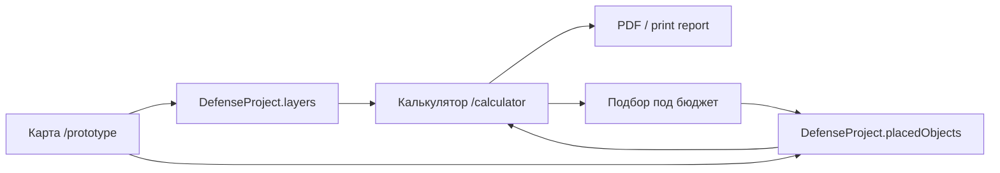
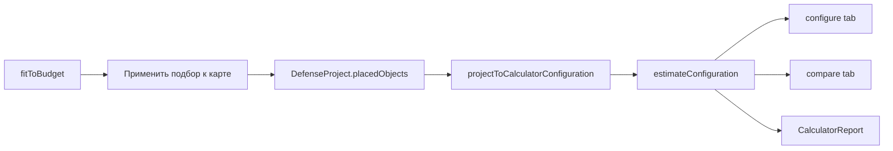

# Defense Studio: архитектура, модель данных и рабочие сценарии

> Статус: актуальный инженерный обзор по состоянию на 2026-06-04.  
> Аудитория: продукт, дизайн, разработка и будущие агенты Codex.  
> Связанные документы: `docs/product/defense-calculator-spec.md`, `docs/product/defense-studio-remediation-spec.md`.

## 1. Что это за часть продукта

Defense Studio — рабочая зона для проектирования защиты объекта от БПЛА. Сейчас она состоит из двух основных маршрутов:

- `/prototype` — карта, эшелоны, каталог средств защиты, свободное размещение объектов и 3D drill-down.
- `/calculator` — смета, сравнение конфигураций, подбор под бюджет и print/PDF-отчёт.

Целевая продуктовая логика: пользователь собирает конфигурацию на карте, а калькулятор и отчёт считают именно эту текущую конфигурацию. Источник истины для новой логики — `DefenseProject`, а не отдельная таблица калькулятора.

Короткая цепочка:



## 2. Технологический стек

- Next.js `16.2.5`, App Router.
- React `19.2.4`.
- Zustand `5.x` для client-side stores.
- Deck.gl, MapLibre и `react-map-gl` для GIS-карты.
- Three.js, `@react-three/fiber`, `@react-three/drei` для 3D-сцены.
- Ant Design icons, локальные UI primitives и Tailwind-style utility classes.
- Browser print для PDF-отчёта.

Команды проекта:

```bash
pnpm dev
pnpm build
pnpm lint
```

Важно: `AGENTS.md` требует перед изменением Next.js-кода читать релевантный guide в `node_modules/next/dist/docs/`, потому что версия Next отличается от привычных API и соглашений.

## 3. Архитектурные правила проекта

Проект использует лёгкую FSD-структуру:

```text
src/
  app/       # маршруты App Router, без бизнес-логики
  shared/    # общие типы, конфиги, pure helpers, stores общего уровня
  modules/   # функциональные срезы: ui/domain/infra
```

Правила импортов:

- `app/` страницы должны быть тонкими.
- `shared/` не импортирует из `modules/`.
- Внутри модуля направление зависимостей: `ui -> domain -> infra`.
- Если двум модулям нужна общая модель, она выносится в `shared/`.

Пример текущих тонких страниц:

- `src/app/(defense-studio)/prototype/page.tsx` рендерит `DroneDefensePrototype`.
- `src/app/(defense-studio)/calculator/page.tsx` рендерит `CalculatorPage`.
- `src/app/(defense-studio)/layout.tsx` оборачивает оба route в `DefenseStudioShell`.

## 4. Route shell и навигация

`DefenseStudioShell` находится в `src/modules/drone-defense/ui/defense-studio-shell.tsx`.

Shell отвечает за:

- левый rail на desktop;
- mobile header и mobile segmented nav;
- переходы `Карта`, `Расчёт`, `3D`;
- общий светлый workspace-фон.

Состояние `3D` сейчас хранится в `useDefenseStudioStore.view`. Поэтому ссылка `3D` ведёт на `/prototype`, но ставит `view = "drilldown"`. Карта активна, когда route `/prototype` и `view !== "drilldown"`.

## 5. Главные модели данных

### 5.1. DefenseProject

Основная модель текущей проектной конфигурации описана в `src/shared/types/defense-project.ts`.

Ключевые поля:

- `baseObject` — защищаемый объект с координатами центра.
- `layers` — редактируемые эшелоны проекта.
- `assetLibrary` — библиотека средств защиты.
- `placedObjects` — реально размещённые на карте объекты.
- `activeLayerId` — выбранный эшелон.
- `selectedAssetId` — выбранное средство для размещения.
- `mode` — режим работы проекта.
- `source` / `basePresetId` — происхождение конфигурации.

Принципиально: эшелон не хранит свой список средств. Наполнение эшелона считается как:

```ts
project.placedObjects.filter((object) => object.layerId === layer.id)
```

### 5.2. EditableDefenseLayer

Эшелон проекта — это `EditableDefenseLayer`.

В v1 UI ориентирован на кольцевую геометрию:

- `geometry.type = "ring"`;
- `geometry.center`;
- `geometry.minRadiusM`;
- `geometry.maxRadiusM`.

Дополнительные поля:

- `code`, например `L2`;
- `name`;
- `description`;
- `order`;
- `color`;
- `opacity`;
- `isActive`;
- `isVisible`;
- `isLocked`.

Стартовые L1-L9 лежат в `src/shared/config/default-defense-layers.ts`. Это шаблон проекта, а не жёсткая бизнес-модель. Пользовательская модель допускает изменение количества эшелонов. Сейчас в store задан максимум `20`, минимум обеспечивается запретом удаления последнего эшелона.

### 5.3. DefenseAssetLibraryItem

Средства защиты описаны в `DefenseAssetLibraryItem` и строятся из общего каталога:

- `id`, `name`, `shortName`;
- `category`, `roles`;
- `pricePerUnitMln`;
- `unitLabel`;
- `recommendedLayerCodes`;
- `placementType`;
- `score`, `priority`;
- `calculatorAssetId`;
- `mapCatalogGroupIds`.

Файл библиотеки: `src/shared/config/defense-asset-library.ts`.

## 6. Каталоги и mapping

Сейчас есть два исторических источника данных:

1. Карта и прототип: `src/modules/drone-defense/infra/mock-defense-data.ts`.
2. Калькулятор: `src/modules/defense-calculator/infra/catalog-data.ts`.

Общий слой связывания находится в:

- `src/shared/config/defense-catalog.ts`;
- `src/shared/config/defense-asset-library.ts`;
- `src/shared/lib/defense-configuration.ts`;
- `src/shared/lib/defense-project.ts`.

Задача общего каталога — связать:

```text
canonical defense item id
  <-> map catalog group id
  <-> calculator asset id
```

Примеры mapping:

- `mobile-radar` <-> `l2-radar` <-> `mobile-radar`;
- `ew-narrowband` <-> `l4-ew-gnss` <-> `ew-narrowband`;
- `ew-broadband` <-> `l4-ew-radio` <-> `ew-broadband`;
- `interceptor-drones` <-> `l5-interceptor` <-> `interceptor-drones`;
- `passive-itz-bundle` <-> `l8-anti-drone-nets`, `l8-cable-systems`, `l9-armoring`, `l9-spacing`.

Map-only элементы получили ориентировочные CAPEX, synthetic score и `calculatorAssetId: null`. Для калькулятора они преобразуются в synthetic assets, чтобы не выпадать из стоимости и группировок.

## 7. Stores

### 7.1. useDefenseProjectStore

Файл: `src/shared/lib/use-defense-project-store.ts`.

Persist key:

```text
fortis-defense-project
```

Store содержит:

- `project`;
- `hydrated`;
- selection-поля: `activeLayerId`, `selectedAssetId`, `selectedObjectId`;
- actions для слоёв, размещённых объектов, пресетов, budget selection, import/export.

Основные actions:

- `createLayer`;
- `updateLayer`;
- `deleteLayer`;
- `moveLayerUp` / `moveLayerDown`;
- `setLayerVisibility`;
- `setLayerLocked`;
- `selectLayer`;
- `selectAsset`;
- `setAssetQuantity`;
- `placeObject`;
- `moveObject`;
- `updatePlacedObject`;
- `deletePlacedObject`;
- `loadPresetProject`;
- `applyBudgetSelection`;
- `restoreProjectFromLocalStorage`.

Ограничения:

- максимум эшелонов: `MAX_DEFENSE_PROJECT_LAYERS = 20`;
- удалить последний эшелон нельзя;
- удалить эшелон с объектами нельзя;
- удалить locked эшелон нельзя;
- placement валидируется через геометрию активного слоя.

### 7.2. useDefenseConfigurationStore

Файл: `src/shared/lib/use-defense-configuration-store.ts`.

Persist key:

```text
fortis-current-configuration
```

Это более старая модель `SelectedConfiguration`, основанная на `{ itemId: quantity }`. Сейчас она сохраняется для совместимости и миграции. Новый основной workflow работает через `DefenseProject`.

`useDefenseProjectStore.restoreProjectFromLocalStorage()` умеет восстановиться из старой конфигурации через `legacySelectedConfigurationToProject`.

### 7.3. useDefenseStudioStore

Файл: `src/modules/drone-defense/domain/use-defense-studio-store.ts`.

Это store старого прототипа. Он держит:

- загрузку mock/runtime данных;
- `view: "gis" | "drilldown" | ...`;
- `facilityId`;
- `scenarioId`;
- старую `configuration` с placements;
- local 3D placements.

Важно: сценовые/локальные 3D placements пока остаются здесь, потому что это координатная и демонстрационная логика drill-down. Канонические средства защиты карты живут в `DefenseProject.placedObjects`.

## 8. Pure helpers

Главный файл проектной логики: `src/shared/lib/defense-project.ts`.

Важные функции:

- `createDefaultDefenseProject`;
- `createRingLayer`;
- `updateLayerGeometryFromRadii`;
- `isPointInsideLayerGeometry`;
- `validateObjectPlacement`;
- `placeObjectInProject`;
- `movePlacedObjectInProject`;
- `updatePlacedObjectInProject`;
- `deletePlacedObjectInProject`;
- `deleteLayerFromProject`;
- `updateLayerOrder`;
- `setAssetQuantityInProject`;
- `calculateProjectTotalCost`;
- `calculateProjectTotalUnits`;
- `calculateProjectTotalObjects`;
- `calculateLayerConflicts`;
- `calculateLayerSummaries`;
- `projectToCalculatorConfiguration`;
- `legacySelectedConfigurationToProject`;
- `exportDefenseProjectJson`;
- `importDefenseProjectJson`.

Калькуляторная pure-логика:

- `src/modules/defense-calculator/domain/scoring.ts`;
- `src/modules/defense-calculator/domain/costing.ts`;
- `src/modules/defense-calculator/domain/budget-fit.ts`.

Ключевые расчёты:

- weighted score `0..100`;
- priority color `green | orange | red`;
- стоимость позиции `quantity * unitPriceMln`;
- rollup по эшелонам;
- greedy budget fit.

## 9. Карта `/prototype`

Корневой UI: `src/modules/drone-defense/ui/drone-defense-prototype.tsx`.

Компонент собирает:

- shell workspace layout;
- левую панель объекта, активного эшелона, объектов эшелона и каталога СЗ;
- `GisBoard` как карту;
- нижнюю панель эшелонов;
- `FacilityDrilldown` для 3D режима.

### 9.1. Нижняя панель эшелонов

Панель имеет два состояния:

- expanded — карточки эшелонов, создание, сворачивание, удаление выбранного эшелона внутри item;
- collapsed — компактная линейка кнопок `L1`, `L2`, ... и кнопка раскрытия.

Глобальная кнопка `3D` из нижней панели удалена; переход в 3D остаётся в левом rail.

Текущее UX-решение:

- `+ Эшелон` создаёт новый слой до лимита 20;
- `Удалить` живёт внутри выбранной карточки эшелона;
- при одном оставшемся эшелоне удаление disabled;
- если в эшелоне есть объекты, store вернёт предупреждение и удаление не выполнится.

### 9.2. Размещение средств

Workflow:

1. Пользователь выбирает активный эшелон.
2. Пользователь выбирает средство в каталоге СЗ.
3. Пользователь кликает по карте.
4. `placeActiveToolAtCoordinate` находит canonical item через `getDefenseItemByMapGroupId`.
5. Store вызывает `validateObjectPlacement`.
6. Если точка внутри кольца или asset non-physical — создаётся `PlacedDefenseObject`.
7. Объект попадает в `DefenseProject.placedObjects`.
8. Карта и калькулятор пересчитываются от того же project state.

Для отображения на карте используется adapter:

```text
DefenseProject.placedObjects
  -> placedObjectsToMapPlacements()
  -> Configuration.placements
  -> buildEchelonMapModel()
  -> Deck.gl layers
```

Adapter лежит в `src/modules/drone-defense/domain/project-map-adapter.ts`.

### 9.3. GisBoard

Файл: `src/modules/drone-defense/ui/gis-board.tsx`.

Отвечает за:

- MapLibre raster base map;
- Deck.gl zones/rings;
- H3 risk/gap overlay;
- routes;
- facility marker;
- placed object markers;
- click по карте для размещения активного средства.

Старый slot UI скрыт из пользовательского интерфейса. Внутренние слоты ещё частично существуют в model helpers как fallback/legacy структура.

## 10. Калькулятор `/calculator`

Корневой UI: `src/modules/defense-calculator/ui/calculator-page.tsx`.

Калькулятор сейчас читает `DefenseProject` из `useDefenseProjectStore`, а не отдельный локальный `useState<Configuration>`.

Основной data flow:



Важные функции:

- `projectToCalculatorConfiguration(project)` агрегирует quantities по calculator asset id.
- `quantityFor(assetId)` суммирует quantity по размещённым объектам.
- `setQuantity(assetId, quantity)` меняет количество через `setAssetQuantity`.
- `loadReference(refId)` загружает preset в `DefenseProject`.
- `applyBudgetSelection` применяет budget picks обратно к проекту.

### 10.1. Tabs

Текущие вкладки:

- `configure` — конфигуратор по эшелонам проекта;
- `compare` — сравнение reference configurations и текущей конфигурации;
- `budget` — подбор под бюджет и применение результата к карте.

Группировка конфигуратора строится по текущим `project.layers`, а не по жёстко пришитому списку L1-L9.

### 10.2. Empty state

Если `project.placedObjects.length === 0`, калькулятор показывает, что конфигурация ещё не собрана и предлагает добавить средства на карте или загрузить эталон.

### 10.3. PDF/print report

Файл: `src/modules/defense-calculator/ui/calculator-report.tsx`.

Отчёт рендерится в print-only блоке и появляется только при `window.print()`.

Содержит:

- дату генерации;
- summary;
- смету выбранной конфигурации;
- таблицу эшелонов карты;
- сравнение конфигураций;
- приоритет средств;
- бюджетный подбор;
- пометку о предварительной экспертной оценке.

`CalculatorReport` получает estimate, reference estimates, scored assets, budget result и `layerSummaries`, построенные из текущего `DefenseProject`.

## 11. Presets и reference configurations

Исторические эталоны:

- `НАК`;
- `НЕВ`;
- `ФОСФОРИТ`;
- `БМУ`.

Их калькуляторные данные живут в `src/modules/defense-calculator/infra/catalog-data.ts`.

Загрузка эталона в новом workflow:

```text
loadPresetProject(presetId)
  -> loadPresetIntoConfiguration(presetId)
  -> legacySelectedConfigurationToProject(configuration)
  -> DefenseProject.placedObjects
```

Важно: старт калькулятора больше не должен подразумевать `НАК` как пользовательскую смету. Базовое состояние — пустая пользовательская конфигурация или восстановленная из `localStorage`.

## 12. Правила валидации

### 12.1. Quantity

Для старой `SelectedConfiguration`:

- quantity floor до целого;
- минимум 0;
- максимум `item.maxQuantity`, если задан;
- 0 удаляет item из `selectedItems`.

Для `DefenseProject`:

- `PlacedDefenseObject.quantity` минимум 1;
- `setAssetQuantityInProject` создаёт/удаляет физические placed objects до нужного количества.

### 12.2. Placement

`validateObjectPlacement(project, assetId, layerId, coordinates)`:

- требует выбранный layer и asset;
- запрещает размещение в locked layer;
- для физических assets проверяет попадание точки в геометрию layer;
- для `non-physical` assets геометрия не блокирует placement;
- если asset размещается не в recommended layer, возвращает warning, но placement разрешён.

### 12.3. Layer deletion

`deleteLayerFromProject` запрещает:

- удалить несуществующий layer;
- удалить последний layer;
- удалить locked layer;
- удалить layer, в котором есть placed objects.

## 13. Тесты

Текущие targeted тесты запускаются через `tsx`.

Проектная модель:

```bash
npx tsx src/shared/lib/defense-project.test.ts
npx tsx src/shared/lib/use-defense-project-store.test.ts
npx tsx src/modules/drone-defense/domain/project-map-adapter.test.ts
```

Старая shared configuration:

```bash
npx tsx src/shared/lib/defense-configuration.test.ts
npx tsx src/shared/lib/use-defense-configuration-store.test.ts
```

Калькулятор:

```bash
npx tsx src/modules/defense-calculator/domain/scoring.test.ts
npx tsx src/modules/defense-calculator/domain/costing.test.ts
```

Дополнительные contract-тесты карты:

```bash
npx tsx src/modules/drone-defense/domain/defense-studio-contract.test.ts
npx tsx src/modules/drone-defense/domain/echelon-build-assets-contract.test.ts
npx tsx src/modules/drone-defense/domain/echelon-catalog-contract.test.ts
npx tsx src/modules/drone-defense/domain/echelon-map-model-contract.test.ts
npx tsx src/modules/drone-defense/domain/echelon-slot-contract.test.ts
npx tsx src/modules/drone-defense/domain/layer-distance-contract.test.ts
```

Quality gates перед деплоем:

```bash
pnpm lint
pnpm build
```

На момент написания `pnpm build` проходит, но Next.js показывает warning про inferred workspace root из-за нескольких lockfile. Это инфраструктурное предупреждение, не runtime ошибка.

## 14. Локальный запуск и smoke checklist

Запуск:

```bash
pnpm dev
```

Если порт `3000` занят, Next может подняться на `3001`.

Smoke `/prototype`:

- открывается shell с левым rail;
- карта видна и не пустая;
- активный эшелон подсвечен;
- нижняя панель разворачивается/сворачивается;
- `+ Эшелон` создаёт слой до лимита 20;
- `Удалить` внутри выбранной карточки не удаляет последний слой;
- выбор средства в каталоге и click по карте создаёт объект внутри кольца;
- click вне кольца для physical asset даёт ошибку;
- placed object появляется в левой панели и на карте.

Smoke `/calculator`:

- если конфигурация пустая, виден empty state;
- после placement на карте quantity и total обновляются;
- загрузка `НАК` меняет карту и калькулятор;
- tabs `configure`, `compare`, `budget` работают;
- `Применить подбор к карте` записывает picks в project;
- `PDF-отчёт` открывает browser print с табличным отчётом.

## 15. Текущие ограничения и технический долг

- Backend/PostGIS/GeoServer не подключены; GIS и catalog runtime остаются mock/demo.
- Есть две исторические модели конфигурации: `SelectedConfiguration` и `DefenseProject`. Новая логика должна идти через `DefenseProject`; старую модель держать только для совместимости, пока миграция не завершена.
- Старый slot model частично присутствует в helpers, хотя пользовательский slot UI скрыт.
- 3D local placements пока живут отдельно в `useDefenseStudioStore`, а не полностью синхронизированы с canonical project objects.
- UI редактирования всех свойств layer был намеренно упрощён. Подробное редактирование радиуса, ширины, цвета, opacity, visibility и lock есть на уровне store/helpers, но не вынесено в текущий visible UI.
- `mapOnlyDefenseAssets` в калькуляторе строит synthetic scoring из общего каталога. Это прозрачная экспертная заглушка, а не финальная методика.
- `window.print()` зависит от браузерного print pipeline; отдельного server-side PDF generator пока нет.
- `localStorage` — единственный persistence слой v1.

## 16. Рекомендации для следующих изменений

При добавлении новой функциональности:

1. Сначала определить, это project-level логика или scene/demo-level логика.
2. Project-level класть в `shared/types/defense-project.ts`, `shared/lib/defense-project.ts`, `use-defense-project-store.ts`.
3. Не добавлять cross-module imports из `shared` в `modules`.
4. Для новых средств защиты обновлять canonical catalog, а не только calculator или map mock отдельно.
5. Для UI `/prototype` помнить, что карта — основная рабочая поверхность; тяжёлые настройки должны быть collapsible или вынесены в отдельное состояние.
6. Для `/calculator` считать от `DefenseProject`, не возвращаться к локальному `useState<Configuration>`.
7. Для опасных действий со слоями сохранять правило: не удалять silently, если есть placed objects.
8. После изменений прогонять targeted tests и `pnpm build`.

## 17. Быстрый словарь

- Эшелон / layer — кольцевая зона вокруг защищаемого объекта.
- Asset / средство защиты — элемент библиотеки СЗ, который можно разместить или учесть в смете.
- Placed object — конкретное размещение asset на карте с `coordinates`, `layerId`, `quantity`, `status`.
- Preset / reference configuration — эталонная конфигурация `НАК`, `НЕВ`, `ФОСФОРИТ`, `БМУ`.
- Map-only item — средство из карты без исходного calculator asset; сейчас имеет ориентировочный CAPEX и synthetic scoring.
- Conflict — placed object, который после изменения геометрии слоя оказался вне границ своего эшелона.
